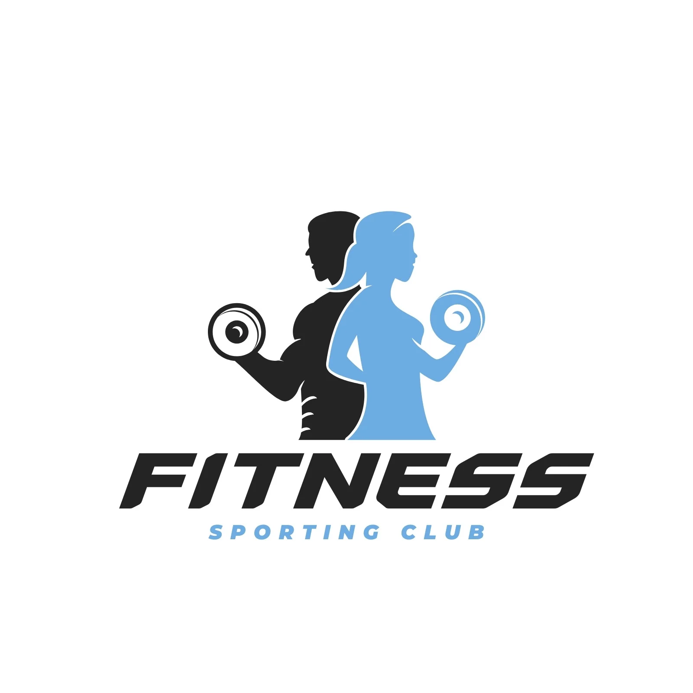
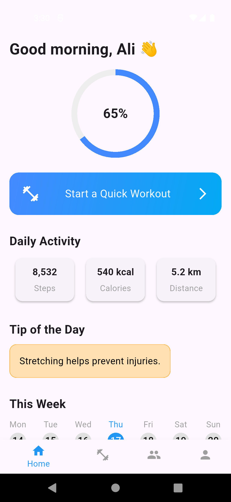
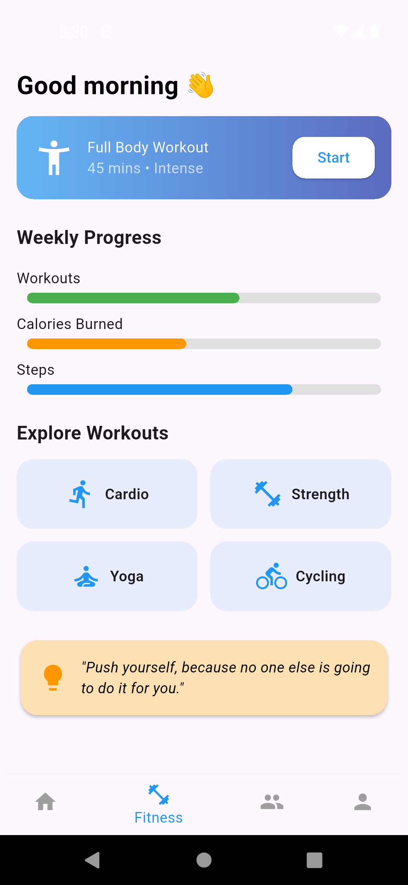
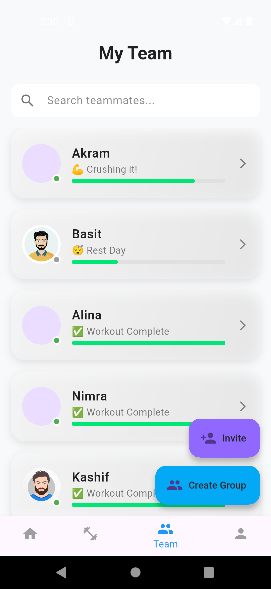
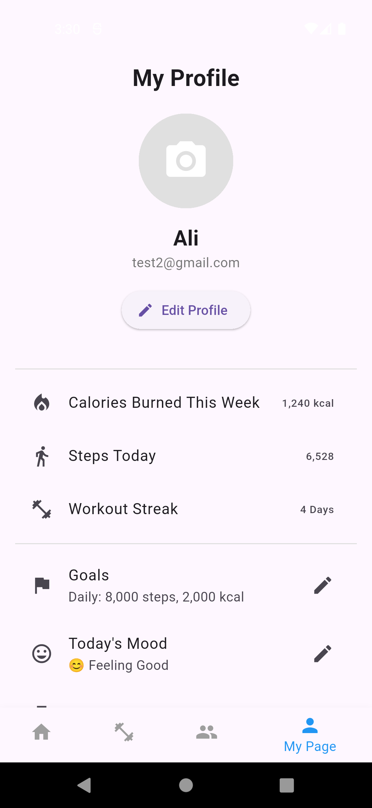

# 💪 Fitness Pro App

Welcome to **Fitness Pro** – your ultimate fitness companion built with 💙 **Flutter**! Whether you're a beginner or a pro, Fitness Pro helps you track workouts, set goals, and stay motivated with a sleek, intuitive design.

<p align="center">
  
</p>


---

## 🚀 Features

✨ **Beautiful UI**  
Modern and responsive design with smooth animations and eye-catching components.

🧘 **Workout Categories**  
Full body, cardio, yoga, strength, and more – all organized for easy access.

📅 **Daily Workout Planner**  
Schedule your sessions and stay consistent with built-in reminders.

📈 **Progress Tracker**  
Monitor your daily and weekly progress visually with stats and charts.

🌙 **Dark Mode Support**  
Enjoy the experience in both light and dark themes for comfort and style.

🔔 **Notifications**  
Stay on track with timely workout reminders.

---

## 📱 Screenshots

<table>
  <tr>
    <th>Home</th>
    <th>Fitness</th>
    <th>Team</th>
    <th>Profile</th>
  </tr>
  <tr>
    <td></td>
    <td></td>
    <td></td>
    <td></td>
  </tr>
</table>


---

## 🛠️ Tech Stack

- **Flutter** – Cross-platform app development
- **Dart** – For smooth, fast logic handling
- **Provider / Bloc** – State management
- **Hive / Shared Preferences** – Local data storage
- **Firebase** *(optional)* – Cloud sync, auth, and analytics

---

## 📦 Installation

1. **Clone the repo**
   ```bash
   git clone https://github.com/hasaan-azeem/fitness-pro-app.git

2. **Navigate into the project directory**
   ```bash
   cd fitness-pro-app

3. **Get the dependencies**
   ```bash
   flutter pub get

4. **Run the app**
   ```bash
   flutter run

## 🤝 Contributing

Contributions are welcome!  
Feel free to **fork** this repo, **improve it**, and make a **pull request**.  
Whether it's a bug fix, feature, or documentation – all kinds of help is appreciated. 🙌

---

## 📄 License

This project is licensed free – feel free to use and modify it.

---

## 🙌 Credits

Created with ❤️ by **Hasaan Azeem**  
Special thanks to the amazing **Flutter** community for resources and inspiration.

---

## 📬 Let's Connect
  
- 💼 **LinkedIn:** [Hasaan Azeem](https://www.linkedin.com/in/hasaan-azeem)  

---

> _"Fitness is not about being better than someone else… it’s about being better than you used to be."_ 💪
